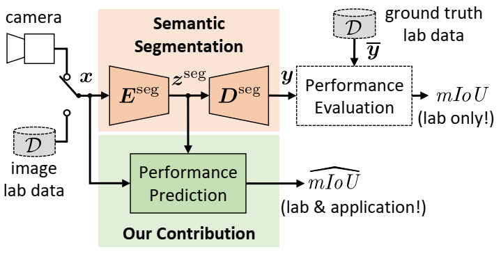
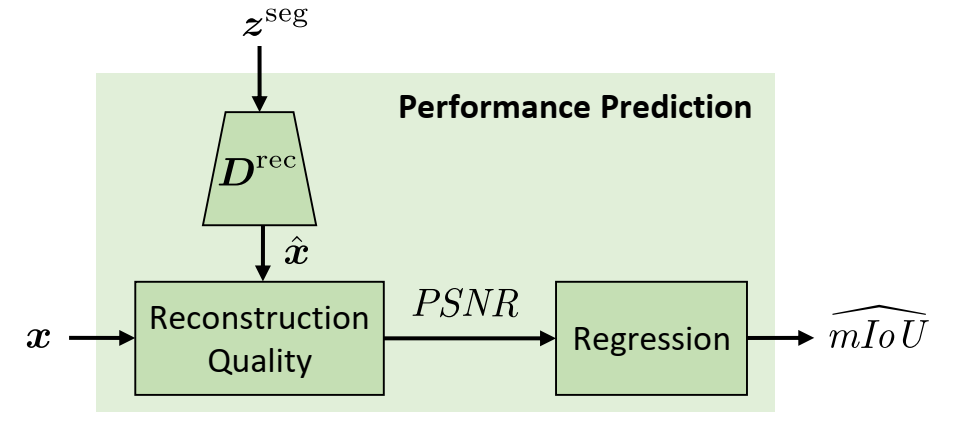

# Performance Prediction for Semantic Segmentation by a Self-Supervised Image Reconstruction Decoder
[Andreas Bär](https://www.tu-braunschweig.de/en/ifn/institute/team/sv/baer), [Marvin Klingner](https://www.tu-braunschweig.de/en/ifn/institute/team/sv/klingner), Jonas Löhdefink, Fabian Hüger, Peter Schlicht, and [Tim Fingscheidt](https://www.tu-braunschweig.de/en/ifn/institute/team/sv/fingscheidt)

[Link to paper](https://openaccess.thecvf.com/content/CVPR2022W/WAD/papers/Bar_Performance_Prediction_for_Semantic_Segmentation_by_a_Self-Supervised_Image_Reconstruction_CVPRW_2022_paper.pdf)

[Link to supplementary material](https://openaccess.thecvf.com/content/CVPR2022W/WAD/supplemental/Bar_Performance_Prediction_for_CVPRW_2022_supplemental.pdf)

[Link to poster](https://www.researchgate.net/publication/366596260_Poster_of_the_paper_Performance_Prediction_for_Semantic_Segmentation_by_a_Self-Supervised_Image_Reconstruction_Decoder)

## Idea Behind the Paper
**System Overview**



**Performance Prediction Module**



In our work, we propose a novel per-image performance prediction for semantic segmentation.
Our proposed method is sensor-efficient, data-efficient, and training-efficient.
Specifically, we extend an already trained semantic segmentation network having fixed parameters with an image reconstruction decoder.
After training and a subsequent regression, the image reconstruction quality is evaluated to predict the semantic segmentation performance.

## Citation
If you find our code helpful or interesting for your research, please consider citing

```
@InProceedings{Baer2022,
  author    = {Andreas B\"{a}r and Marvin Klingner and Jonas L\"{o}hdefink and Fabian H\"{u}ger and Peter Schlicht and Tim Fingscheidt},
  booktitle = {Proc.\ of CVPR - Workshops},
  title     = {{Performance Prediction for Semantic Segmentation and by a Self-Supervised Image Reconstruction Decoder}},
  year      = {2022},
  address   = {New Orleans, LA, USA},
  month     = jun,
  pages     = {4399--4408},
}
```

## Acknowledgments
I would like to thank [Daniel Kusuma](https://github.com/ksmdnl) in helping me setting up this repository.
I would also especially like to thank my co-author Jonas Löhdefink who passed away too early.
We will never forget you, my friend.

## Our Models
Results are reported for the Cityscapes Lindau validation set

SwiftNet semantic segmentation baseline:

| mIoU  | Download link |
|-------|---------------|
| 65.02 | [model](https://drive.google.com/drive/folders/1m433jSb2A5AVXrEBE7UUMp79mkExhHn1?usp=share_link)     |

SwiftNet-based reconstruction decoder models:

| Reconstruction Decoder | Lat. | SPP | Clean | FGSM | PGD  | Gaussian | S&P   | all | Download link                                                                                     |
|------------------------|------|-----|-------|------|------|----------|-------|-----|---------------------------------------------------------------------------------------------------|
| SwiftNet               |      |     | 0.19  | 0.77 | 0.78 | 0.70     | 0.78  | 0.76| [model](https://drive.google.com/drive/folders/1dxKv-4AcZBAeoOXzGUZabiBjbX7QSxry?usp=share_link)  |
| SwiftNet               |      | x   | 0.20  | 0.77 | 0.79 | 0.70     | 0.77  | 0.76| [model](https://drive.google.com/drive/folders/1dxKv-4AcZBAeoOXzGUZabiBjbX7QSxry?usp=share_link)  |
| SwiftNet               | x    |     | -0.01 | 0.88 | 0.85 | 0.83     | 0.86  | 0.85| [model](https://drive.google.com/drive/folders/1dxKv-4AcZBAeoOXzGUZabiBjbX7QSxry?usp=share_link)                                                                                         |
| SwiftNet               | x    | x   | -0.01 | 0.88 | 0.84 | 0.83     | 0.85  | 0.84| [model](https://drive.google.com/drive/folders/1dxKv-4AcZBAeoOXzGUZabiBjbX7QSxry?usp=share_link)                                                                                         |

ResNet-based reconstruction decoder models:

| Reconstruction Decoder | Block config | Clean | FGSM | PGD  | Gaussian | S&P  | all  | Download link                                                                                    |
|------------------------|--------------|-------|------|------|----------|------|------|--------------------------------------------------------------------------------------------------|
| ResNet10               | 1-1-1-1      | 0.24  | 0.82 | 0.82 | 0.76     | 0.84 | 0.81 | [model](https://drive.google.com/drive/folders/1dxKv-4AcZBAeoOXzGUZabiBjbX7QSxry?usp=share_link) |
| ResNet26               | 3-3-3-3      | 0.21  | 0.84 | 0.83 | 0.77     | 0.82 | 0.82 | [model](https://drive.google.com/drive/folders/1dxKv-4AcZBAeoOXzGUZabiBjbX7QSxry?usp=share_link)                                                                                        |
| ResNet18L              | 2-2-2-2      | 0.08  | 0.88 | 0.85 | 0.83     | 0.86 | 0.85 | [model](https://drive.google.com/drive/folders/1dxKv-4AcZBAeoOXzGUZabiBjbX7QSxry?usp=share_link)                                                                                        |


## Prerequisites and Requirements
To install the environment from scratch, follow the following steps:
```
conda create --name swiftnet-pp python=3.7.12
source activate swiftnet-pp
conda install pytorch=1.10.2 torchvision=0.11.3 torchaudio=0.10.2 cudatoolkit=10.2 -c pytorch
conda install matplotlib=3.2.2 scipy=1.7.3 scikit-image=0.19.3 numba=0.55.1
conda install -c conda-forge wand=0.6.5
pip install opencv-python==4.5.5.62
pip install "git+https://github.com/ifnspaml/IFN_Dataloader.git"
pip install "git+https://github.com/ifnspaml/TUBSRobustCheck.git"
```

To install the environment via environment.txt, follow the following steps:
```
conda env create --file environment.yml
source activate swiftnet-pp
pip install "git+https://github.com/ifnspaml/IFN_Dataloader.git"
pip install "git+https://github.com/ifnspaml/TUBSRobustCheck.git"
```

For reference: The `environment.yml` was created by exporting the environment via `conda env export > environment.yml` on our Linux cluster.

## Training
For training according to our method, please first use `train_swiftnet.py` (training SwiftNet for semantic segmentation) and then `train_swiftnet_rec.py` (loading a trained SwiftNet for semantic segmentation (frozen weights) and train an additional reconstruction decoder).
Please refer to `swiftnet.sh` and `swiftnet_rec.sh` for example usages.

## Evaluation On Clean And Corrupted Images
For evaluation according to our method, please use `eval/eval_attacks_n_noise.py`. Please refer to `eval/attacks.sh` for example usages.
After running `eval/eval_attacks_n_noise.py` you can compute metrics with the generated output file.
For metric computation, please use `metrics/compute_metrics.py`.
Example output files can be found in the folder `output`.

## Regression
To perform a regression analysis (predicting mIoU from PSNR) you need to first run `eval/eval_attacks_n_noise.py` to produce output files containing mIoU and PSNR statistics (e.g., mIoU and PSNR statistics of the Cityscapes validation subset).
Next, you need to run `metrics/regression.py` to perform a regression analysis.
Please choose a calibration output file (calibrating the regression) and a regression output file (perform an mIoU prediction).
Example output files can be found in the folder `output`.

## License

The original SwiftNet model in this project was developed by Marin Oršić et al. [here](https://github.com/orsic/swiftnet).
The Project was released under the GNU General Public License v3.0. This code modifies some parts of the original code and
is therefore also licensed under the GNU General Public License v3.0. Please feel free to use it within the boundaries of this license.